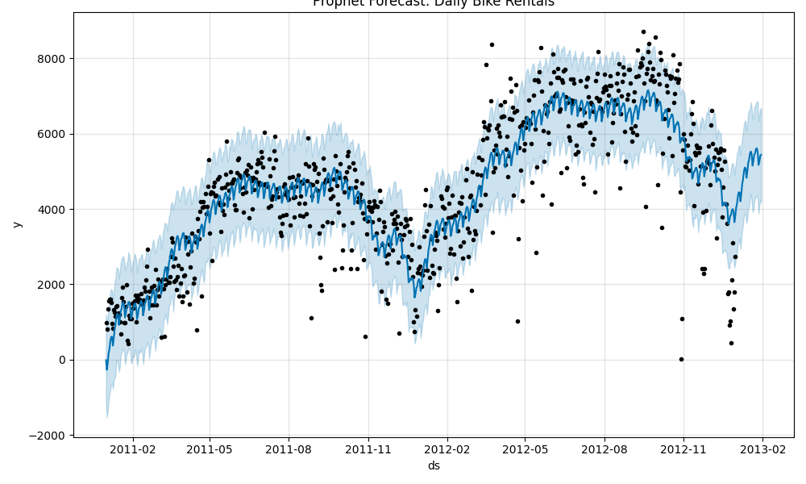

# 🚲 Bike Rental Forecast with Facebook Prophet

This project uses the UCI Bike Sharing Dataset to forecast daily bike rentals using Facebook Prophet.

## 📁 Project Structure

bike_rental_forecast/
├── main.py ← entry point
├── models/
│ └── prophet_model.py
├── data/
│ └── day.csv
├── outputs/
│ └── forecast_plot.png
└── notebooks/
└── eda_and_preprocessing.ipynb


## 🚀 How to Run

1. Clone the repo
2. (Optional) Create a virtual environment:
    ```bash
    python -m venv .venv
    source .venv/bin/activate  # or .venv\Scripts\activate on Windows
    ```
3. Install dependencies:
    ```bash
    pip install -r requirements.txt
    ```

4. Run the forecast:
    ```bash
    python -m bike_rental_forecast.main
    ```

5. The forecast plot will be saved in:
    ```
    bike_rental_forecast/outputs/forecast_plot.png
    ```

## 📈 Sample Output


